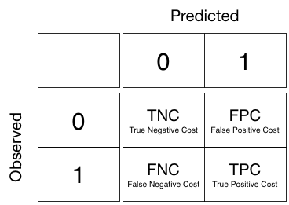

footer: univ.ai
autoscale: true

#[fit] Bayes Theorem

---

## Throwing darts, uniformly


Throwing darts at the wall to find P(A|B). (a) Darts striking the wall. (b) All the darts in either A or B. (c) The darts only in B. (d) The darts that are in the overlap of A and B.

(pics like these from Andrew Glassner's book)

---

# Conditional Probability


conditional probability tells us the chance that one thing will happen, given that another thing has already happened. In this case, we want to know the probability that our dart landed in blob A, given that we already know it landed in blob B.

---

## Other conditional and joint


Left: the other conditional

Below: the joint probability $$p(A, B)$$, the chance that any randomly-thrown dart will land in both A and B at the same time.


---

## The joint probability can be written 2 ways


---

# Bayes Theorem

Equating these gives us Bayes Theorem.

$$P(A \mid B) P(B) = P(B \mid A) P(A)$$

$$P(A \mid B)  = \frac{P(B \mid A) P(A)}{P(B)}$$

the LHS probability $$P(A \mid B)$$is called the posterior, while P(A) is called the prior, and p(B) is called the evidence

---

# A quick test and a slow test for the disease MP

We’d measure everyone in a town with our slow and expensive test (giving us the ground truth), as well as our faster, cheaper blood test. Our measurements show that the blood test seems to have a high true positive rate. We found that 99% of the time, someone with MP is correctly diagnosed. Since the TP rate is 0.99, the false negative (FN) rate, which contains all of the people with MP who we did not correctly diagnose, is 0.01. The test does a bit worse for people who don’t have MP. The true negative (TN) rate is 0.98, so 98 times out of 100 when we say someone is not infected, they really aren’t. This means that the false positive (FP) rate is 0.02, so 2 people in 100 who don’t have MP will get an incorrect positive diagnosis.

(From Glassner, Andrew. Deep Learning, Vol. 1)

---

Let’s suppose that we’ve just heard of a suspected outbreak of MP in a new town of 10,000 people. From experience, given the amount of time that has passed, we expect that 1% of the population is already infected. This is essential information. We’re not testing people blindly. We already know that most people do not have MP. There’s only a 1 in 100 chance that someone does have it. But even one infected person is one person too many, so we head into town at top speed. Arriving in town, we get everyone to come down to city hall to get tested. Suppose someone comes up positive. What should they think? How likely is it that they have MP? Suppose instead the test is negative. How likely is it that they don’t have it?

---

 

---

#[fit]Decision Theory
#[fit]Model Comparison


*Predictions (or actions based on predictions) are described by a utility or loss function, whose values can be computed given the observed data*.

---

### Key Question: What Machine Learning Model should I use?

- That is, How do I compare two regression models?
- Or two classification models
- Might I want to use both?
- Or even combine them?

(we saw examples of the latter last week with Random Forests and Boosting)

---

## Custom Loss: Stock Market Returns


```python
def stock_loss(stock_return, pred, alpha = 100.):
    if stock_return * pred < 0:
        #opposite signs, not good
        return alpha*pred**2 - np.sign(stock_return)*pred \
                        + abs(stock_return)
    else:
        return abs(stock_return - pred)
```


---

## The two risks

There are *two risks in learning* that we must consider, one to *estimate probabilities*, which we call **estimation risk**, and one to *make decisions*, which we call **decision risk**.

The **decision loss** $$l(y,a)$$ or **utility** $$u(l,a)$$ (profit, or benefit) in making a decision $$a$$ when the predicted variable has value $$y$$. For example, we must provide all of the losses $$l$$(no-cancer, biopsy), $$l$$(cancer, biopsy), $$l$$(no-cancer, no-biopsy), and $$l$$(cancer, no-biopsy). One set of choices for these losses may be 20, 0, 0, 200 respectively.

---

#EVALUATING AND COMPARING CLASSIFIERS


---

## Metrics (from Glassner)

- accuracy is a number from 0 to 1. It’s a general measure of how often the prediction is correct.
- Precision (also called positive predictive value, or PPV) tells us the percentage of our samples that were properly labeled “positive,” relative to all the samples we labeled as “positive.” Numerically, it’s the value of TP relative to TP+FP. In other words, precision tells us how many of the “positive” predictions were really positive.
- recall, (also called sensitivity, hit rate, or true positive rate). This tells us the percentage of the positive samples that we correctly labeled.
- F1 score is the harmonic mean of precision and recall. Generally speaking, the f1 score will be low when either precision or recall is low, and will approach 1 when both measures also approach 1.

---

## Metrics (example)


---


## Classification Risk

$$ R_{a}(x) = \sum_y l(y,a(x)) p(y|x)$$

That is, we calculate the **predictive averaged risk** over all choices y, of making choice a for a given data point.

Overall risk, given all the data points in our set:

$$R(a) = \int dx p(x) R_{a}(x)$$

---

## Two class Classification

$$R_a(x) = l(1, g)p(1|x) + l(0, g)p(0|x).$$

Then for the "decision" $$a=1$$ we have:

$$R_1(x) = l(1,1)p(1|x) + l(0,1)p(0|x),$$

and for the "decision" $$a=0$$ we have:

$$R_0(x) = l(1,0)p(1|x) + l(0,0)p(0|x).$$


---

Now, we'd choose $$1$$ for the data point at $$x$$ if:

$$R_1(x) \lt R_0(x).$$

$$ P(1|x)(l(1,1) - l(1,0)) \lt p(0|x)(l(0,0) - l(0,1))$$

So, to choose '1', the Bayes risk can be obtained by setting:

$$p(1|x) \gt r P(0|x) \implies r=\frac{l(0,1) - l(0,0)}{l(1,0) - l(1,1)}$$

$$P(1|x) \gt t = \frac{r}{1+r}$$.

---

One can use the prediction cost matrix corresponding to the consufion matrix

$$ r  =  =\frac{c_{FP} - c_{TN}}{c_{FN} - c_{TP}}$$

If you assume that True positives and True negatives have no cost, and the cost of a false positive is equal to that of a false positive, then $$r=1$$ and the threshold is the usual intuitive $$t=0.5$$.



---


#[fit]COMPARING CLASSIFERS

Telecom customer Churn data set from @YhatHQ[^<]


[^<]: http://blog.yhathq.com/posts/predicting-customer-churn-with-sklearn.html

---

#ASYMMETRIC CLASSES

- A has large FP[^#]
- B has large FN. 
- On asymmetric data sets, A will do very bad.
- Both downsampling and unequal classes are used in practice


---

#[fit]ROC SPACE[^+]


$$TPR = \frac{TP}{OP} = \frac{TP}{TP+FN}.$$

$$FPR = \frac{FP}{ON} = \frac{FP}{FP+TN}$$


[^+]: this+next fig: Data Science for Business, Foster et. al.

---


#[fit]ROC Curve


---

#ROC CURVE

- Rank test set by prob/score from highest to lowest
- At beginning no +ives
- Keep moving threshold
- confusion matrix at each threshold

---

#ROC curves


---


#ASYMMETRIC CLASSES


$$r = \frac{l_{FN}}{l_{FP}}$$

We look for lines with slope

$$\frac{p(0)}{r\,p(1)} = \frac{p(-)}{r\,p(+)} \sim \frac{10}{r}$$

Large $$r$$ penalizes FN.

Churn and Cancer u dont want FN: an uncaught churner or cancer patient (P=churn/cancer)


---


#Lift Curve

- Rank test set by prob/score from highest to lowest
- Calculate TPR for each confusion matrix ($$TPR$$) 
- Calculate fraction of test set predicted as positive ($$x$$)
- Plot $$Lift = \frac{TPR}{x}$$ vs $$x$$. Lift represents the advantage of a classifier over random guessing.

---

#EXPECTED VALUE FORMALISM

Can be used for risk or profit/utility (negative risk)

$$EP = p(1,1) \ell_{11} + p(0,1) \ell_{10} + p(0,0) \ell_{00} + p(1,0) \ell_{01}$$


$$EP = p_a(1) [TPR\,\ell_{11} + (1-TPR) \ell_{10}]$$
         $$ + p_a(0)[(1-FPR) \ell_{00} + FPR\,\ell_{01}]$$
        
Fraction of test set pred to be positive $$x=PP/N$$:

$$x = (TP+FP)/N = TPR\,p_o(1) + FPR\,p_o(0)$$

---


#Profit curve

- Rank test set by prob/score from highest to lowest
- Calculate the expected profit/utility for each confusion matrix ($$U$$) 
- Calculate fraction of test set predicted as positive ($$x$$)
- plot $$U$$ against $$x$$

---

#Finite budget[^#]


- 100,000 customers, 40,000 budget, 5$ per customer
- we can target 8000 customers
- thus target top 8%
- classifier 1 does better there, even though classifier 2 makes max profit

[^#]: figure from Data Science for Business, Foster et. al.

